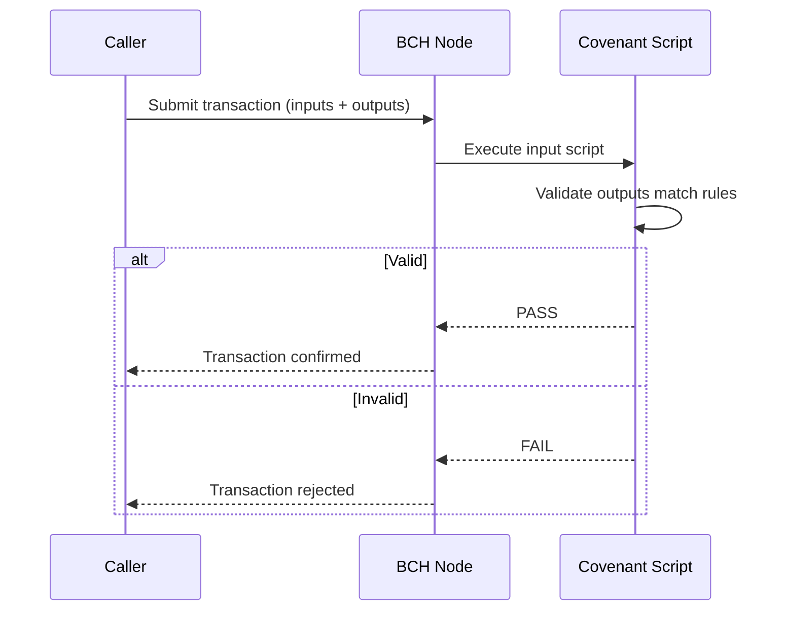
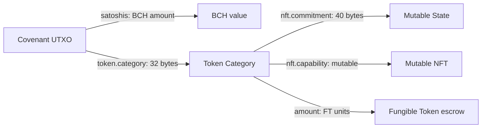

## CashScript Covenants

CashScript is a high-level language that compiles to Bitcoin Script. A **covenant** is a contract that constrains what outputs a spending transaction must produce. When you spend a covenant UTXO, the script evaluates the entire transaction and fails if the outputs don't match the expected shape.



### Key Properties

- **Immutable parameters**: values like `senderHash`, `totalAmount`, `intervalSeconds` are compiled into the bytecode at deployment. They cannot change.
- **Mutable state**: values like `total_released`, `cursor`, `status` are stored in the CashTokens NFT commitment. They update with every transaction.
- **No trusted executor**: the contract enforces the rules. No FlowGuard server can override a valid spending path or block a valid claim.

## CashTokens NFT Commitments

Every FlowGuard covenant holds a **mutable NFT** with a commitment field of up to **40 bytes**. This commitment is the entire mutable state of the contract.

### Commitment Layout Pattern

All contracts follow the same layout convention:

```
[0]:    status (uint8)
[1]:    flags (uint8)
[2..]: contract-specific state fields
```

### Example: VestingCovenant Commitment (40 bytes)

```
Byte  0:    status          (0=ACTIVE, 1=PAUSED, 2=CANCELLED, 3=COMPLETED)
Byte  1:    flags           (bit0=cancelable, bit1=transferable, bit2=usesTokens)
Bytes 2-9:  total_released  (uint64, satoshis or FT units)
Bytes 10-14: cursor         (5 bytes, unix timestamp - adjusted for pauses)
Bytes 15-19: pause_start   (5 bytes, 0 if not paused)
Bytes 20-39: recipient_hash (bytes20, hash160 of recipient pubkey)
```

### Reading Commitment State

The indexer decodes each NFT commitment using the shared type definitions in `shared/types/covenant-types.ts`. Every `CovenantUTXO<TState>` object carries the decoded state alongside the raw UTXO reference.

```typescript
interface CovenantUTXO<TState = any> {
  utxo: UTXORef;       // txid + vout
  address: string;     // P2SH32 covenant address
  satoshis: bigint;    // BCH in the UTXO
  token?: CashTokenData; // CashTokens data
  state: TState;       // decoded NFT commitment
  height: number;      // block height created
  timestamp: bigint;   // block timestamp
}
```

## P2SH32 Addresses

FlowGuard contracts compile to P2SH32 addresses (32-byte hash of the redeem script). Each unique configuration of parameters produces a unique address. Two vesting schedules with different `totalAmount` values will have different addresses even if everything else is identical.

<Warning>
Always verify the contract address against the expected bytecode hash for the parameters you deployed with. The `DeploymentRegistryService` tracks all deployed covenants for this purpose.
</Warning>

## The Token Category Link

Every covenant UTXO holds a CashTokens NFT. The `tokenCategory` (32-byte identifier) ties the NFT and any fungible token amount together. When a covenant holds FT escrow (e.g. a vesting stream of a CashToken), the FT and the state NFT share the same `tokenCategory`.


