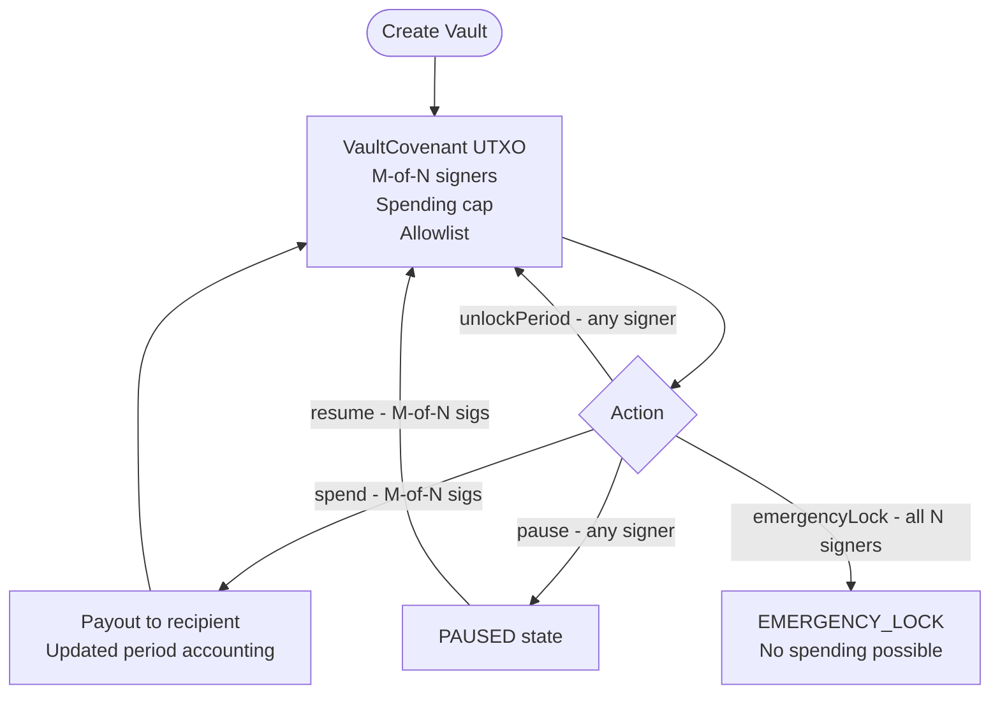

A **Vault** is the foundational treasury contract in FlowGuard. Every streaming, distribution, or governance covenant links back to a Vault via `vaultId`. The Vault enforces multi-party control over funds without any custodian.

## How Vaults Work



## Key Parameters

| Parameter | Type | Description |
|-|-|-|
| `vaultId` | `bytes32` | Unique identifier linking covenants to this vault |
| `requiredApprovals` | `int` | Approval metadata for the vault. Current shipped spend/resume paths operate within a fixed three-signer design. |
| `signer1Hash` | `bytes20` | `hash160` of signer 1 pubkey |
| `signer2Hash` | `bytes20` | `hash160` of signer 2 pubkey |
| `signer3Hash` | `bytes20` | `hash160` of signer 3 pubkey |
| `periodDuration` | `int` | Seconds per spending period (0 = no period cap) |
| `periodCap` | `int` | Max satoshis spendable per period (0 = unlimited) |
| `recipientCap` | `int` | Max satoshis per single spend (0 = unlimited) |
| `allowlistEnabled` | `int` | 1 = only `allowedAddr1/2/3` can receive funds |
| `allowedAddr1/2/3` | `bytes20` | Recipient allowlist slots in the current three-address implementation |

## NFT State Layout (32 bytes)

```
Byte 0:    version (uint8)
Byte 1:    status  (0=ACTIVE, 1=PAUSED, 2=EMERGENCY_LOCK, 3=MIGRATING)
Bytes 2-4: rolesMask (3 bytes)
Bytes 5-8: current_period_id (uint32)
Bytes 9-16: spent_this_period (uint64, satoshis)
Bytes 17-24: last_update_timestamp (uint64, unix seconds)
Bytes 25-31: reserved
```

## Functions

<AccordionGroup>
  <Accordion title="spend() ,  Execute a payout with M-of-N approval">
    Called by any M signers simultaneously. Verifies two distinct signers from the registered set, enforces period cap, recipient cap, and allowlist. Automatically rolls the period forward if `periodDuration` has elapsed.

    ```
    spend(sig sig1, pubkey pubkey1, sig sig2, pubkey pubkey2,
          bytes32 proposalId, bytes20 recipientHash, int payoutAmount,
          int newPeriodId, int newSpent)
    ```
  </Accordion>
  <Accordion title="unlockPeriod() ,  Roll period forward without spending">
    Any registered signer can call this after `periodDuration` has elapsed. Resets `spent_this_period` to 0 and increments `current_period_id`. Does not move any funds.
  </Accordion>
  <Accordion title="pause() ,  Freeze the vault">
    Any single registered signer can pause the vault immediately. Use for fast incident response. Resume requires M-of-N.
  </Accordion>
  <Accordion title="resume() ,  Unfreeze the vault">
    Requires M-of-N signers. Transitions status from PAUSED back to ACTIVE.
  </Accordion>
  <Accordion title="emergencyLock() ,  Full lockdown">
    Requires **all 3** registered signers simultaneously. Transitions to `EMERGENCY_LOCK`. No spending path is available from this state in the current contract version.

    <Warning>
      Emergency lock is irreversible in the current contract version. Deploy a new vault if recovery is needed after an emergency lock.
    </Warning>
  </Accordion>
</AccordionGroup>

## Spending Roles

| Who | Can Do |
|-|-|
| Any single signer | `pause()`, `unlockPeriod()` |
| Two distinct registered signers | `spend()`, `resume()` |
| All three registered signers | `emergencyLock()` |
| No one | Override covenant math, skip period cap |

<Note>
Current FlowGuard vault contracts hardcode three signer slots and three allowlist slots. BCH network upgrades can expand what future FlowGuard covenants may support, but larger signer sets still require explicit contract rewrites and redeployment in FlowGuard.
</Note>
