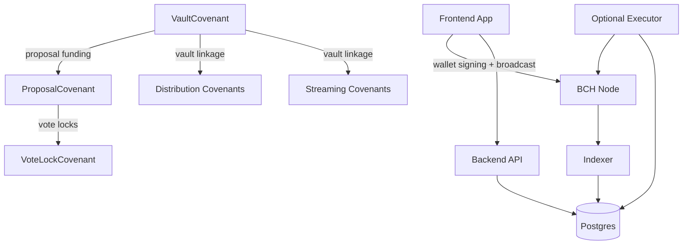
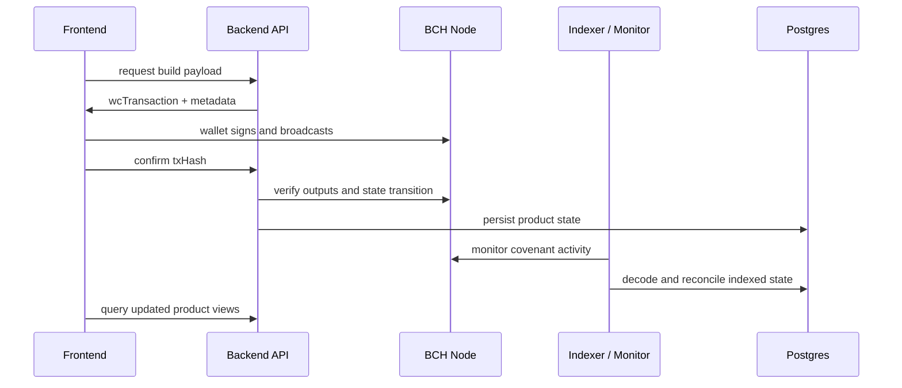
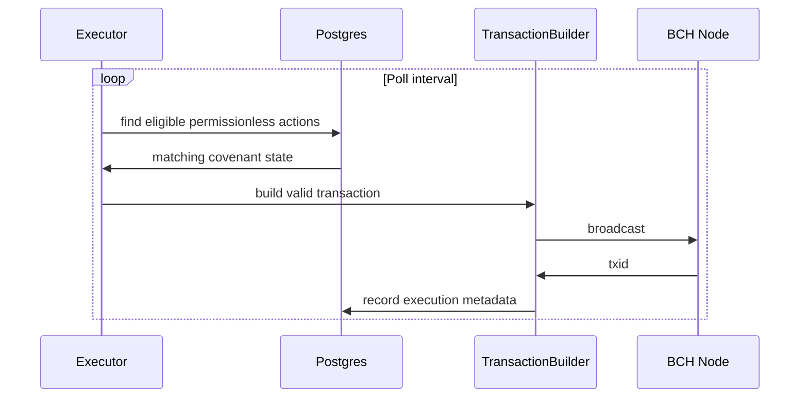

## System overview

FlowGuard has three main layers:

- On-chain covenant state on Bitcoin Cash.
- Backend services that build, confirm, index, and monitor transactions.
- Frontend product surfaces for treasury, streams, distributions, and governance.

## Contract Families

| Family       | Contracts                                                                                                 |
| ------------ | --------------------------------------------------------------------------------------------------------- |
| Treasury     | `VaultCovenant`, `ProposalCovenant`                                                                       |
| Governance   | `VoteLockCovenant`                                                                                        |
| Streaming    | `VestingCovenant`, `RecurringPaymentCovenant`, hybrid/tranche schedule variants built on the stream stack |
| Distribution | `AirdropCovenant`, `GrantCovenant`, `BountyCovenant`, `RewardCovenant`                                    |

## Commitment Sizes

| Contract family    | Commitment size |
| ------------------ | --------------- |
| Vault state        | 32 bytes        |
| Proposal state     | 64 bytes        |
| Schedule state     | 48 bytes        |
| Distribution state | 40 bytes        |
| Vote lock state    | 32 bytes        |

These sizes map to the shared encoding helpers and shared TypeScript state definitions.

## Data Flow

## Executor Role

The executor is optional infrastructure. It exists to improve liveness for permissionless transitions such as timed recurring payouts and similar eligible actions.

## Core Backend Services

| Service                     | Responsibility                                         |
| --------------------------- | ------------------------------------------------------ |
| `StreamDeploymentService`   | deploy stream covenant families                        |
| `StreamFundingService`      | fund stream contracts                                  |
| `StreamClaimService`        | build stream claim transactions                        |
| `StreamCancelService`       | build stream cancel flows                              |
| `StreamControlService`      | pause, resume, refill, and transfer supported streams  |
| `PaymentDeploymentService`  | deploy recurring payment contracts                     |
| `PaymentClaimService`       | build recurring payout transactions                    |
| `PaymentControlService`     | pause, resume, cancel, and refill recurring payments   |
| `AirdropDeploymentService`  | deploy airdrop contracts                               |
| `AirdropClaimService`       | build claim transactions                               |
| `AirdropControlService`     | handle campaign control flows                          |
| `BudgetDeploymentService`   | deploy budget-plan style distribution contracts        |
| `BudgetFundingService`      | fund budget-plan contracts                             |
| `BudgetReleaseService`      | build release transactions for milestone-style payouts |
| `BudgetControlService`      | pause, resume, and cancel budget-plan state            |
| `VaultFundingService`       | build and confirm vault funding                        |
| `ProposalService`           | proposal records, approvals, execution sessions        |
| `VoteDeploymentService`     | deploy vote lock contracts                             |
| `VoteLockService`           | build vote lock flows                                  |
| `VoteUnlockService`         | build reclaim flows                                    |
| `DeploymentRegistryService` | verify and report deployment records                   |
| `TransactionMonitor`        | verify and track submitted transactions                |
| `MerkleTreeService`         | generate Merkle trees for restricted airdrops          |

## Source of Truth

The blockchain is the source of truth for contract validity.

The backend database is the source of truth for product indexing, history, and UI-friendly aggregation.

The frontend is the operator and user surface that presents those indexed states and routes signing through the connected wallet.
